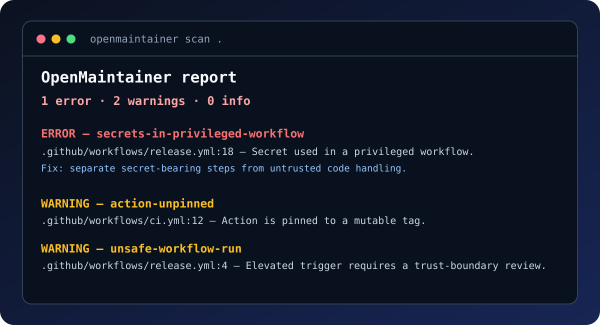

# OpenMaintainer

[](https://github.com/Kaneki599/openmaintainer/actions/workflows/verify.yml)
[](https://github.com/Kaneki599/openmaintainer/releases)
[](LICENSE)

<p align="center">
  
</p>

**Find risky GitHub Actions workflow patterns before they become maintenance debt.**

OpenMaintainer is a local-first, read-only GitHub Action and CLI. It scans the
repository already checked out by CI, explains each finding, and never uploads
source code or rewrites workflow files.

<p align="center"><strong>One command. Clear locations. Actionable fixes.</strong></p>

## See the result

<p align="center">
  
</p>

It currently detects invalid workflow YAML, unpinned third-party Actions,
implicit or `write-all` token permissions, risky `pull_request_target` and
`workflow_run` triggers, and secrets used in privileged workflows.

## Try it in 30 seconds

Add this job to any repository you control:

```yaml
name: OpenMaintainer

on:
  pull_request:
  push:
    branches: [main]

permissions:
  contents: read

jobs:
  scan:
    runs-on: ubuntu-latest
    steps:
      - uses: actions/checkout@08c6903cd8c0fde910a37f88322edcfb5dd907a8 # v5.0.0
      - uses: Kaneki599/openmaintainer@v0.1.2
        with:
          output: openmaintainer-report.md
```

The workflow fails only for **error** findings. Warnings and informational
findings leave CI green while still producing a report.

## Why OpenMaintainer?

- **Explainable:** every finding points to a file, line, and remediation.
- **Local-first:** the scanner reads the checkout it is given.
- **Safe by default:** it only reports; it never changes a repository.
- **Composable:** checks emit a stable JSON report for CI and other tools.

## CLI

Requires Node.js 20 or newer.

```sh
npm install
npm run check
npm test
```

## Scan a repository

```sh
npx openmaintainer scan .
npx openmaintainer scan . --format json --output openmaintainer-report.json
```

An `error` finding returns exit code `1`; warnings and informational findings
do not fail CI.

### Configuration

Create `openmaintainer.yml` in the repository root to suppress a justified
rule. Suppressed rules should be reviewed periodically rather than used to
silence findings globally.

```yaml
ignore:
  - action-unpinned
```

See [`examples/`](examples/) for a deliberately insecure workflow and a
configuration example.

## GitHub Action

```yaml
- uses: Kaneki599/openmaintainer@v0.1.2
  with:
    format: markdown
    output: openmaintainer-report.md
```

The action is read-only. It scans the checked-out repository and writes a
report; it does not upload source code or alter workflow files.

## Releases and Marketplace

Use `Kaneki599/openmaintainer@v0.1.2` for an exact release. The `v0` tag is
maintained as the current compatible v0 release channel.

Marketplace publication has one owner-only GitHub step; see
[docs/marketplace-submission.md](docs/marketplace-submission.md).

## Contributing and security

See [CONTRIBUTING.md](CONTRIBUTING.md) for development and rule standards, and
[SECURITY.md](SECURITY.md) for responsible vulnerability reporting.

## Roadmap

- [ ] SARIF export for GitHub Code Scanning.
- [ ] Baseline mode to surface only new findings.
- [ ] Optional project-health checks for release and contributor documentation.
- [ ] Additional workflow rules proposed and reviewed by the community.

See [CHANGELOG.md](CHANGELOG.md) for release notes and
[CODE_OF_CONDUCT.md](CODE_OF_CONDUCT.md) for community expectations.

## License

[Apache-2.0](LICENSE)
